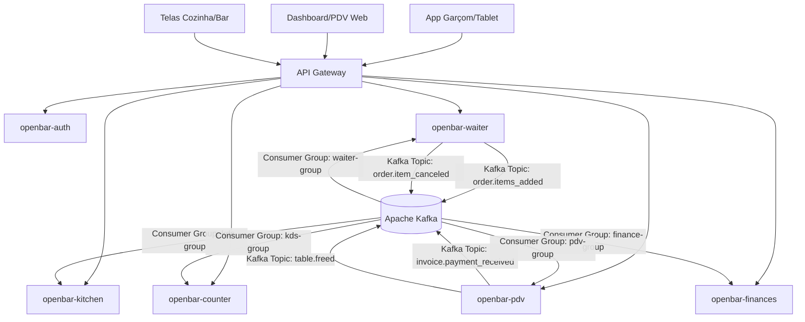
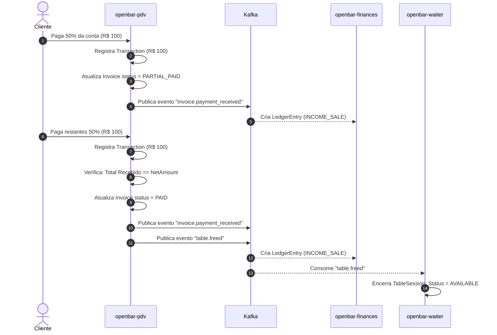
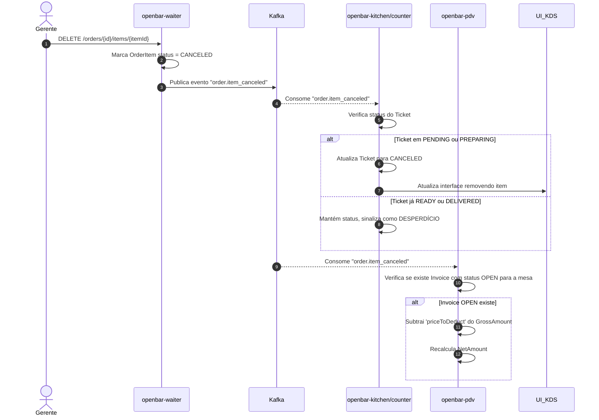

# Documento de Especificação Arquitetural e Requisitos (Master Blueprint)

**Projeto:** OPENBAR - Gestão Integrada de Bares e Restaurantes

## 1. Visão Geral e Stack Tecnológica Base

As definições abaixo são mandatórias para a infraestrutura de todos os microsserviços. Nenhuma dependência legada deve ser utilizada.

* **Linguagem:** Kotlin 2.4.10 (Target JVM: Java 25)
* **Framework:** Spring Boot 4.1.0 (WebFlux para chamadas não-bloqueantes onde necessário, MVC padrão para REST síncrono)
* **Build System:** Gradle (Kotlin DSL, `build.gradle.kts`)
* **Persistência Relacional:** PostgreSQL 16+ (Mapeamento via Spring Data JPA / Hibernate)
* **Mensageria (Event-Driven):** Apache Kafka (Tópicos particionados por filial/tenant)
* **Cache e Filas em Memória:** Redis (Gerenciamento de KDS e Sessões/Tokens bloqueados)
* **Migração de Banco de Dados:** Flyway (Scripts obrigatórios na pasta `db/migration`)
* **Configuração Ambiental:** `.env` injetado no `application.yml` nativo do Spring. Nunca fixar credenciais no código.

## 2. Diretrizes Globais de Design (Core Rules)

* **Design API First:** Todas as APIs devem seguir o padrão RESTful nível 2 ou 3 (Maturidade de Richardson).
* **Tratamento de Exceções:** Implementação obrigatória de `@RestControllerAdvice` global retornando a estrutura **RFC 7807 (Problem Details)** em todos os serviços.
* **Segurança Inter-serviços:** O API Gateway (ou cliente frontend) repassa o token JWT nos headers (`Authorization: Bearer`). Cada microsserviço valida a assinatura do token via chave pública (RS256) localmente, sem consultar o banco de dados do `openbar-auth` a cada requisição (Stateless).
* **Resiliência:** Uso de *Circuit Breaker* (Resilience4j) em chamadas síncronas entre serviços.
* **Paginação Padrão:** Todos os endpoints de listagem (ex: histórico de pedidos, faturas fechadas) devem utilizar a interface `Pageable` do Spring Data, retornando o objeto empacotado (`content`, `totalPages`, `totalElements`, `size`, `number`).

---

## 3. Diagrama de Arquitetura de Rede e Eventos



---

## 4. Dicionário de Dados e Contratos por Microsserviço

### 4.1 Módulo `openbar-auth` (Gestão de Identidade e Acesso)

Responsável por emitir JWTs e manter o cadastro de funcionários.

**Modelo de Dados (PostgreSQL)**

| Entidade | Campo | Tipo (Kotlin) | Regras e Constraints |
| --- | --- | --- | --- |
| **User** | `id` | `UUID` | PK (Primary Key). |
|  | `username` | `String` | UNIQUE, NOT NULL (CPF ou Email). |
|  | `passwordHash` | `String` | NOT NULL, BCrypt Workload 12. |
|  | `role` | `Enum` | `ADMIN`, `MANAGER`, `WAITER`, `CASHIER`, `KITCHEN`. |
|  | `active` | `Boolean` | DEFAULT true. Soft delete. |

**Contrato de API Principal**

* **POST** `/api/v1/auth/login`
* **Payload:** `{"username": "admin", "password": "123"}`
* **Response:** `200 OK` | `{"accessToken": "eyJhb...", "expiresIn": 3600}`


### 4.2 Módulo `openbar-waiter` (Operação de Salão)

Gerencia a alocação de clientes nas mesas e a abertura do estado transacional do pedido.

**Modelo de Dados (PostgreSQL)**

| Entidade | Campo | Tipo (Kotlin) | Regras e Constraints |
| --- | --- | --- | --- |
| **TableSession** | `id` | `UUID` | PK. |
|  | `tableNumber` | `Int` | NOT NULL. Número físico da mesa. |
|  | `status` | `Enum` | `AVAILABLE`, `OCCUPIED`, `CLOSING`. |
| **Order** | `id` | `UUID` | PK. |
|  | `tableSessionId` | `UUID` | FK. Relaciona com a mesa ocupada. |
|  | `waiterId` | `UUID` | Usuário que abriu. |
| **OrderItem** | `id` | `UUID` | PK. |
|  | `orderId` | `UUID` | FK para Order. |
|  | `productId` | `UUID` | FK lógica (produto do catálogo). |
|  | `quantity` | `Int` | MIN 1. |
|  | `routing` | `Enum` | `KITCHEN`, `COUNTER` (Define para qual fila vai). |
|  | `status` | `Enum` | `ACTIVE`, `CANCELED`. |

**Contrato de API Principal**

* **POST** `/api/v1/waiter/orders/{orderId}/items`
* **Payload:**
```json
{
  "waiterId": "a1b2c3d4-...",
  "items": [
    {
      "productId": "99887766-...",
      "quantity": 2,
      "notes": "Sem cebola, bem passado",
      "routing": "KITCHEN"
    }
  ]
}

```


### 4.3 Módulos `openbar-kitchen` e `openbar-counter` (KDS)

Ambos possuem a mesma arquitetura de banco e código, mudando apenas os eventos que consomem baseados na rota. Uso de **Redis** para fila real-time e **PostgreSQL** para histórico.

**Modelo de Dados (Híbrido)**

| Entidade | Campo | Tipo (Kotlin) | Regras e Constraints |
| --- | --- | --- | --- |
| **Ticket** | `id` | `UUID` | PK. |
|  | `orderItemId` | `UUID` | FK lógica do `openbar-waiter`. |
|  | `tableNumber` | `Int` | Desnormalizado para velocidade de leitura na tela. |
|  | `status` | `Enum` | `PENDING`, `PREPARING`, `READY`, `DELIVERED`, `CANCELED`. |
|  | `slaWarning` | `Boolean` | TRUE se tempo em PENDING > 15 minutos. |

**Contrato de API Principal**

* **PATCH** `/api/v1/kds/tickets/{id}/status`
* **Payload:** `{"status": "READY"}`
* **Response:** `204 No Content`


### 4.4 Módulo `openbar-pdv` (Faturamento e Caixa)

Transforma itens consumidos em valores monetários, controla descontos e pagamentos.

**Modelo de Dados (PostgreSQL)**

| Entidade | Campo | Tipo (Kotlin) | Regras e Constraints |
| --- | --- | --- | --- |
| **Invoice** | `id` | `UUID` | PK. |
|  | `tableSessionId` | `UUID` | FK lógica do `openbar-waiter`. |
|  | `grossAmount` | `BigDecimal` | Soma total dos itens. |
|  | `serviceFee` | `BigDecimal` | 10% padrão, editável. |
|  | `discount` | `BigDecimal` | Valor de desconto aplicado. |
|  | `netAmount` | `BigDecimal` | `grossAmount` + `serviceFee` - `discount`. |
|  | `status` | `Enum` | `OPEN`, `PARTIAL_PAID`, `PAID`. |
| **Transaction** | `id` | `UUID` | PK. |
|  | `invoiceId` | `UUID` | FK para Invoice. |
|  | `amount` | `BigDecimal` | Valor recebido. |
|  | `method` | `Enum` | `CREDIT`, `DEBIT`, `PIX`, `CASH`. |

**Contrato de API Principal**

* **POST** `/api/v1/pdv/invoices/{invoiceId}/pay`
* **Payload:** `{"amount": 150.50, "method": "CREDIT", "operatorId": "f5e4d3c2-..."}`
* **Response:** `200 OK` (Com status atualizado da fatura)


### 4.5 Módulo `openbar-finances` (Backoffice Financeiro)

Audita abertura/fechamento de turnos e fluxo de caixa. Não mapeia mesas, apenas movimentação monetária.

**Modelo de Dados (PostgreSQL)**

| Entidade | Campo | Tipo (Kotlin) | Regras e Constraints |
| --- | --- | --- | --- |
| **Shift** | `id` | `UUID` | PK. |
|  | `openedBy` | `UUID` | FK Lógica do operador de caixa. |
|  | `openingBalance` | `BigDecimal` | Dinheiro na gaveta ao abrir. |
|  | `closingBalance` | `BigDecimal` | Dinheiro contado ao fechar. |
|  | `status` | `Enum` | `OPEN`, `CLOSED`, `DIVERGENT`. |
| **LedgerEntry** | `id` | `UUID` | PK. |
|  | `shiftId` | `UUID` | FK para Shift. |
|  | `entryType` | `Enum` | `INCOME_SALE`, `INCOME_SUPPLY`, `EXPENSE_BLEED`. |
|  | `amount` | `BigDecimal` | Valor do movimento. |

---

## 5. Contratos de Mensageria (Kafka Payloads)

Todas as mensagens devem ser publicadas no formato JSON, encapsuladas na seguinte estrutura padrão.

* **Tópico:** `order.items_added`
```json
{
  "orderItemId": "UUID",
  "tableNumber": 12,
  "productId": "UUID",
  "quantity": 2,
  "notes": "Sem cebola",
  "routing": "KITCHEN",
  "timestamp": "2026-07-16T14:30:00Z"
}

```


* **Tópico:** `invoice.payment_received`
```json
{
  "invoiceId": "UUID",
  "transactionId": "UUID",
  "amount": 50.00,
  "method": "PIX",
  "timestamp": "2026-07-16T15:10:00Z"
}

```


* **Tópico:** `table.freed`
```json
{
  "tableSessionId": "UUID",
  "tableNumber": 12,
  "timestamp": "2026-07-16T15:12:00Z"
}

```


* **Tópico:** `order.item_canceled`
```json
{
  "orderItemId": "UUID",
  "canceledBy": "UUID",
  "priceToDeduct": 25.50,
  "timestamp": "2026-07-16T14:45:00Z"
}

```


---

## 6. Fluxos de Negócio Complexos e Assíncronos

### 6.1 Fluxo de Divisão de Conta e Liberação de Mesa

Este diagrama instrui como lidar com pagamentos parciais no PDV até que a mesa seja completamente liberada para o salão.



### 6.2 Fluxo de Cancelamento de Item (Estorno Operacional)

Se um garçom cancelar um item que já foi enviado para a cozinha, a cozinha precisa ser alertada e, se a conta já estiver sendo gerada, o PDV precisa recalcular a fatura.


